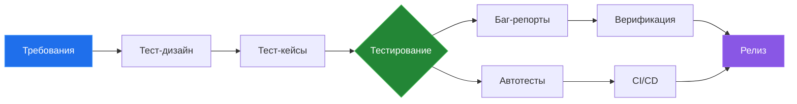

<div align="center">

<!-- HEADER -->


<!-- TYPING SVG -->
<a href="https://git.io/typing-svg">
  
</a>

<!-- PROFILE VIEWS + SOCIALS -->
<br/>

[](https://r0meo1.ru)
[](https://t.me/r0meo_1)
[](mailto:r0meo1.ru@gmail.com)


</div>

---

## `> whoami`

```yaml
name: Роман Неклюдов
role: QA Engineer
location: Архангельск / Северодвинск, Россия
experience: 3+ лет коммерческого опыта
focus:
  - Функциональное и регрессионное тестирование
  - API-тестирование (REST, HTTP, Postman, Swagger)
  - SQL / PostgreSQL — контроль целостности данных
  - Автоматизация тестирования
  - CI/CD и DevOps-процессы
achievements:
  - "↓ 15% сбоев в критичных бизнес-операциях"
  - "↓ 25% среднего времени решения инцидентов"
  - "↑ 8-10 ч/нед экономии на подготовке отчётов"
```

---

## `> cat tech_stack.yml`

<div align="center">

### Languages & Data


### Testing & QA
<p>


</p>

### Infrastructure & Tools


### Frameworks & Platforms
<p>


</p>

</div>

---

## `> ls projects/`

<div align="center">

<table>
<tr>
<td width="50%" valign="top">

###  [r0meo1.ru](https://r0meo1.ru)
**Портфолио QA-инженера**
<br/>Bento-grid, анимации, glassmorphism, тёмная тема, автодеплой.
<br/>`HTML` `CSS` `JS` `Netlify` `GitHub Actions`
<br/>
[](https://github.com/r0meo-1/r0meo1.ru)
[](https://r0meo1.ru)

</td>
<td width="50%" valign="top">

###  [repair-service](https://github.com/r0meo-1/repair-service)
**Сервис управления ремонтными заявками**
<br/>REST API, Docker-контейнеризация, CI/CD pipeline.
<br/>`Python` `Docker` `REST API`
<br/>
[](https://github.com/r0meo-1/repair-service)

</td>
</tr>
<tr>
<td width="50%" valign="top">

###  [turbot-arhangelsk](https://github.com/r0meo-1/turbot-arhangelsk)
**Telegram-бот для подбора туров**
<br/>Пошаговый диалог, валидация, CRM-интеграция, n8n.
<br/>`Python` `Telegram API` `n8n` `CRM`
<br/>
[](https://github.com/r0meo-1/turbot-arhangelsk)
[](https://t.me/turbot_arhangelsk_bot)

</td>
<td width="50%" valign="top">

###  [DnsConf](https://github.com/r0meo-1/DnsConf)
**DNS Block & Redirect Configurator**
<br/>Управление DNS-правилами для Cloudflare / NextDNS.
<br/>`Java`
<br/>
[](https://github.com/r0meo-1/DnsConf)

</td>
</tr>
<tr>
<td width="50%" valign="top">

###  [lavka325x-bot](https://github.com/r0meo-1/lavka325x-bot)
**Telegram-бот поиска по каналу**
<br/>Поиск постов по ключевым словам в истории канала.
<br/>`Python` `Telethon` `pyTelegramBotAPI`
<br/>
[](https://github.com/r0meo-1/lavka325x-bot)

</td>
<td width="50%" valign="top">

###  [Vacation-Planner](https://github.com/r0meo-1/Vacation-Planner)
**Планировщик отпусков**
<br/>Полноценное web-приложение для планирования.
<br/>`TypeScript` `React`
<br/>
[](https://github.com/r0meo-1/Vacation-Planner)

</td>
</tr>
</table>

</div>

---

## `> github stats --verbose`

<div align="center">


</div>

<div align="center">

</div>

<br/>

<div align="center">

</div>

---

## `> cat metrics.json`

<div align="center">

```
┌────────────────────────────────────────────────────────────────────┐
│                                                                    │
│   ↓ 15% сбоев            ↓ 25% время             ↑ 8-10 ч/нед    │
│   критичных операций      решения инцидентов       экономии        │
│                                                                    │
│   100% покрытие           80+ тест-кейсов         10+ багов        │
│   API (32 endpoints)      unit/smoke/регресс       исправлено      │
│                                                                    │
└────────────────────────────────────────────────────────────────────┘
```

</div>

---

## `> cat workflow.md`



---

<div align="center">

### Let's connect

<a href="https://r0meo1.ru"></a>
<a href="https://t.me/r0meo_1"></a>
<a href="https://github.com/r0meo-1"></a>

---


</div>
